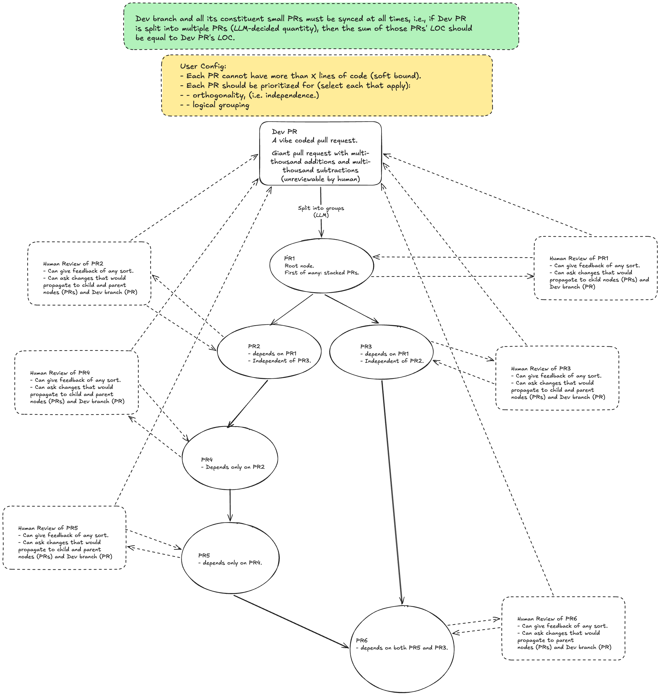

<p align="center">
  
</p>

<h1 align="center">pr-split</h1>

<p align="center">
  Decompose large PRs into a DAG of small, reviewable stacked PRs.
</p>

<p align="center">
  <a href="https://github.com/vitali87/pr-split/blob/main/LICENSE"></a>
</p>

## How it works

`pr-split` takes a large pull request (local branch, fork PR number, or `user:branch`), sends the diff to Claude for analysis, and produces a split plan: a set of smaller, focused PRs arranged in a dependency DAG. Each sub-PR gets its own branch, commit, and GitHub PR targeting the correct base.



## Installation

```bash
# With uv (recommended)
uv tool install pr-split

# With pip
pip install pr-split
```

## Prerequisites

- Python 3.12+
- [GitHub CLI](https://cli.github.com/) (`gh`) authenticated via `gh auth login`
- `ANTHROPIC_API_KEY` environment variable set

## Usage

### Split a local branch

```bash
pr-split split feature-branch --base main
```

### Split a fork PR by number

```bash
pr-split split '#42' --base main
```

### Split a fork PR by user:branch

```bash
pr-split split someuser:feature-branch --base main
```

### Options

| Flag | Default | Description |
|------|---------|-------------|
| `--base` | `main` | Base branch for the diff |
| `--max-loc` | `400` | Soft limit on diff lines per sub-PR |
| `--priority` | `orthogonal` | Grouping priority (`orthogonal` or `logical`) |

### Other commands

```bash
# Show status of an existing split
pr-split status

# Clean up all pr-split branches and close PRs
pr-split clean
```

## Configuration

Settings can be set via environment variables with the `PR_SPLIT_` prefix:

| Variable | Default | Description |
|----------|---------|-------------|
| `ANTHROPIC_API_KEY` | (required) | Anthropic API key |
| `PR_SPLIT_CLAUDE_MODEL` | `claude-sonnet-4-6` | Claude model to use |
| `PR_SPLIT_MAX_LOC` | `400` | Default soft limit on diff lines |
| `PR_SPLIT_PRIORITY` | `orthogonal` | Default grouping priority |

## What it does

1. Extracts the merge-base diff between your branch and the base (same view as GitHub's PR page)
2. Sends the diff to Claude, which groups hunks into logical sub-PRs with dependency ordering
3. Validates the plan: full coverage (every hunk assigned exactly once), no cycles, no merge conflicts between independent groups
4. Shows you the plan (table + dependency tree) and asks for confirmation
5. Creates branches, commits, pushes, and opens GitHub PRs in topological order
6. For diffs exceeding the 1M token context window, automatically chunks the diff and processes sequentially, carrying forward the group catalog across chunks

## License

[MIT](LICENSE)
