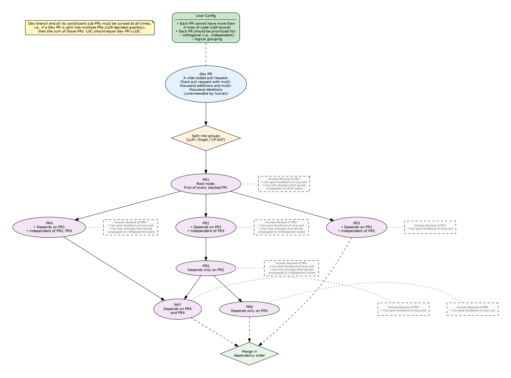

<p align="center">
  
</p>

<h1 align="center">pr-split</h1>

<p align="center">
  Decompose large PRs into a DAG of small, reviewable PRs
</p>

<p align="center">
  <a href="https://github.com/vitali87/pr-split/blob/main/LICENSE"></a>
</p>

## Latest News 🔥

- Stacked PR Mode — pass `--stack` and every dependent PR branches from and targets its parent's branch, so each sub-PR compiles and passes CI on its own. Chains are registered as native GitHub stacks via the `gh-stack` extension when it is installed.
- GitHub Action — add pr-split to any repo as a CI check. Scores every PR and posts a split plan comment when it's too large. No API key needed.
- Smart LOC Bounds — set `--min-loc` and `--max-loc` to control sub-PR size across all three backends (LLM, graph, CP-SAT). Undersized groups get merged, oversized groups get penalised.

## Why pr-split?

Vibe coding with AI assistants can produce massive PRs that no one wants to review. A 2,000 line PR with changes across dozens of files is a review bottleneck: teammates skim it, rubber stamp it, or just ignore it. `pr-split` turns that monolith into a set of focused, bite-sized PRs your team can actually review with confidence. Each sub-PR has a clear purpose, minimal scope, and explicit dependencies, so reviewers know exactly what changed and why.

## How it works

`pr-split` takes a large pull request (local branch, fork PR number, or `user:branch`), sends the diff to an LLM for analysis, and produces a split plan: a set of smaller, focused PRs arranged in a dependency DAG. Each sub-PR gets its own branch, commit, and GitHub PR targeting the correct base.



## Installation

```bash
# With uv (recommended)
uv tool install pr-split

# With pip
pip install pr-split

# With the optional CP-SAT partitioning backend
uv tool install "pr-split[cp-sat]"
```

## Prerequisites

- Python 3.12+
- [GitHub CLI](https://cli.github.com/) (`gh`) authenticated via `gh auth login`
- [`gh-stack` extension](https://github.com/github/gh-stack) (`gh extension install github/gh-stack`) when using `--stack`
- `ANTHROPIC_API_KEY` or `OPENAI_API_KEY` environment variable set when using the `llm` partition backend

## Usage

### Split a local branch

```bash
pr-split split feature-branch --base main
```

### Split a fork PR by number

```bash
pr-split split '#42' --base main
```

### Split a fork PR by user:branch

```bash
pr-split split someuser:feature-branch --base main
```

### Preview a split plan without creating PRs

```bash
pr-split split feature-branch --base main --dry-run
```

### Options

| Flag | Default | Description |
|------|---------|-------------|
| `--base` | `main` | Base branch for the diff |
| `--min-loc` | unset | Minimum target diff lines per sub-PR |
| `--max-loc` | `400` | Maximum target diff lines per sub-PR |
| `--strict-loc-bounds` | `false` | Fail if the final plan violates configured LOC bounds |
| `--max-refinement-iterations` | `0` | Maximum LLM refinement iterations to fix LOC bound violations (0 = disabled) |
| `--priority` | `orthogonal` | Grouping priority (`orthogonal` or `logical`) |
| `--chunk-strategy` | `dynamic_programming` | Large-diff chunking strategy (`dynamic_programming` or `greedy`) |
| `--partition-strategy` | `llm` | Hunk-to-PR partition backend (`llm`, `graph`, or `cp_sat`) |
| `--cp-sat-timeout` | `15.0` | Maximum seconds to spend in the CP-SAT solver |
| `--stack` | `false` | Stack dependent PRs: each child branches from and targets its parent's branch |
| `--draft` | `false` | Open every sub-PR as a draft |
| `--dry-run` | `false` | Preview plan and save to `.pr-split/plan.json` without creating branches or PRs |

### Stack dependent PRs

```bash
pr-split split feature-branch --base main --stack
```

Without `--stack`, every sub-PR branch is cut from the merge base and targets the base branch, so a sub-PR that depends on code from another group only goes green once its dependency merges. With `--stack`, each dependent group's branch is cut from its parent group's branch and carries the parent's hunks for shared files, and its PR targets the parent's branch. Every PR shows only its own diff, compiles standalone, and GitHub retargets children automatically as parents merge.

Linear chains in the plan are registered as [native GitHub stacks](https://github.blog/changelog/2026-07-30-stacked-pull-requests-are-now-in-public-preview/) via the [`gh-stack` extension](https://github.com/github/gh-stack), which is **required** for `--stack`: install it with `gh extension install github/gh-stack`. `pr-split` checks for it up front and refuses to run a stacked split (or `execute` a stacked plan) without it; a `--dry-run` does not need it. If linking fails after the PRs are created, the command exits with an error — the plan state is already saved, so `pr-split clean` can undo the split. Groups that depend on more than one group target the base branch directly, since native stacks are strictly linear; their branch carries every ancestor's changes so it still builds standalone, and those extra changes drop out of the diff as the ancestor PRs merge.

### Check status of an existing split

```bash
pr-split status
```

Shows a table with each sub-PR's ID, title, branch, PR number, live state (OPEN/CLOSED/MERGED), and review decision (Approved, Changes Requested, etc.) queried directly from GitHub.

### Merge split PRs in dependency order

```bash
pr-split merge
```

Walks the dependency DAG and merges each PR in topological order. Skips already-merged, closed, draft, review-required, or changes-requested PRs. Stops if a merge fails or a dependency wasn't merged to prevent out-of-order merges.

Use `--auto` to queue merges behind CI checks (uses `gh pr merge --auto`):

```bash
pr-split merge --auto
```

`--auto` is not fire-and-forget: after queueing a batch, `merge` waits for every PR in it to reach `MERGED` before moving on to the dependent batch, polling GitHub every 10 seconds for up to 10 minutes per batch. If a PR is still unmerged when the timeout expires, or gets closed while waiting, the command stops before the dependent batch and exits 1 (webhook `exit_reason: incomplete_batch`); re-run `pr-split merge --auto` once CI has caught up to continue from where it left off.

Use `--notify` to POST merge results to a webhook URL (e.g. Slack, Discord):

```bash
pr-split merge --notify https://hooks.slack.com/...
```

### Execute a saved dry-run plan

```bash
pr-split execute
```

Creates branches and PRs from a previously saved `--dry-run` plan. Uses the saved diff and merge base for consistency — safe even if the dev branch has changed since the dry run. Pass `--stack` or `--draft` to stack the PRs or open them as drafts even when the plan was saved without those flags.

### Interactive plan editing

After the plan is displayed, an interactive editor lets you adjust the plan before confirming:

```
edit> show pr-1          # inspect a group's assignments
edit> move src/foo.py:2 pr-1 pr-2   # move a hunk between groups
edit> plan               # redisplay the plan table
edit> done               # proceed (default — just press Enter)
edit> abort              # cancel
```

The plan is re-validated after editing to catch empty groups or coverage gaps.

### Custom PR body templates

Create `.pr-split/template.md` to customize the body of each generated PR using placeholders:

```markdown
{description}

### Files
{files}

**Stats:** +{added}/-{removed} ({loc} lines)

{dag}
```

Available placeholders: `{description}`, `{files}`, `{added}`, `{removed}`, `{loc}`, `{dependencies}`, `{dag}`, `{id}`, `{title}`.

### Re-split with different parameters

Running `split` again when a plan already exists will prompt you to clean up existing branches and PRs before re-planning. Dry-run plans are silently overwritten.

### Clean up

```bash
pr-split clean
```

Closes all split PRs, deletes their branches (local and remote), and removes the plan file.

## Configuration

Settings can be set via environment variables with the `PR_SPLIT_` prefix:

| Variable | Default | Description |
|----------|---------|-------------|
| `PR_SPLIT_PROVIDER` | `anthropic` | LLM provider (`anthropic` or `openai`) |
| `ANTHROPIC_API_KEY` | (required for Anthropic) | Anthropic API key |
| `OPENAI_API_KEY` | (required for OpenAI) | OpenAI API key |
| `PR_SPLIT_MODEL` | auto per provider | Model name (defaults to best available model for the chosen provider) |
| `PR_SPLIT_MIN_LOC` | unset | Minimum target diff lines per sub-PR |
| `PR_SPLIT_MAX_LOC` | `400` | Default maximum target diff lines |
| `PR_SPLIT_STRICT_LOC_BOUNDS` | `false` | Fail if the final plan violates configured LOC bounds |
| `PR_SPLIT_MAX_REFINEMENT_ITERATIONS` | `0` | Maximum LLM refinement iterations to fix LOC bound violations (0 = disabled) |
| `PR_SPLIT_PRIORITY` | `orthogonal` | Default grouping priority |
| `PR_SPLIT_CHUNK_STRATEGY` | `dynamic_programming` | Large-diff chunking strategy |
| `PR_SPLIT_PARTITION_STRATEGY` | `llm` | Hunk-to-PR partition backend |
| `PR_SPLIT_CP_SAT_TIMEOUT` | `15.0` | Maximum seconds to spend in the CP-SAT solver |
| `PR_SPLIT_STACK` | `false` | Stack dependent PRs on their parent's branch |
| `PR_SPLIT_DRAFT` | `false` | Open every sub-PR as a draft |
| `PR_SPLIT_WEBHOOK_URL` | (none) | Webhook URL for merge notifications |

## GitHub Action

Add pr-split as a CI check that scores every PR and posts a split plan when it's too large. Uses the `graph` backend by default — no API key needed.

```yaml
# .github/workflows/split-score.yml
name: PR Split Score

on:
  pull_request:
    branches: [main]

permissions:
  pull-requests: write

jobs:
  score:
    runs-on: ubuntu-latest
    steps:
      - uses: actions/checkout@v4
        with:
          fetch-depth: 0

      - uses: vitali87/pr-split@v1.0.0
        with:
          max-loc: "400"
          partition-strategy: "graph"
          threshold-groups: "2"
```

### Action inputs

| Input | Default | Description |
|-------|---------|-------------|
| `max-loc` | `400` | Maximum target diff lines per sub-PR |
| `min-loc` | (unset) | Minimum target diff lines per sub-PR |
| `partition-strategy` | `graph` | Backend for partitioning (`graph` or `cp_sat`). Automatic `ortools` install for `cp_sat` needs a release newer than `v1.0.0`; pin the action to that release or `@main` when using it |
| `priority` | `orthogonal` | Grouping priority (`orthogonal` or `logical`) |
| `threshold-groups` | `2` | Minimum suggested groups before posting the split plan |
| `python-version` | `3.12` | Python version to use |
| `post-comment` | `true` | Whether to post a PR comment with the results |

### Action outputs

| Output | Description |
|--------|-------------|
| `total-loc` | Total lines of code in the PR diff |
| `total-groups` | Number of suggested groups |
| `objective` | Plan objective score (lower is better) |
| `should-split` | Whether the PR should be split (`true`/`false`) |

## Planning backends

`pr-split` now separates two optimization layers:

- **Chunking**: for diffs that exceed the model context window, `dynamic_programming` chooses chunk boundaries to avoid splitting the same file when possible. `greedy` keeps the previous first-fit behavior.
- **Partitioning**: `llm` preserves the original semantic planner, `graph` uses deterministic affinity-based grouping, and `cp_sat` uses an optimization model to balance group count, LOC, and cohesion.

The `cp_sat` backend requires the optional [`ortools`](https://developers.google.com/optimization) package. Install it via the `cp-sat` extra: `uv tool install "pr-split[cp-sat]"`.

For a deeper explanation of the planning model, optimization methods, scoring, and research directions, see [METHODOLOGY.md](METHODOLOGY.md).

## What it does

1. Extracts the merge-base diff between your branch and the base (same view as GitHub's PR page)
2. Sends the diff to the configured backend (LLM, graph, or CP-SAT), which groups hunks into logical sub-PRs with dependency ordering
3. Validates the plan: full coverage (every hunk assigned exactly once), no cycles, no merge conflicts between independent groups
4. Shows you the plan (table + dependency tree) with an optional interactive editor to move hunks between groups
5. Creates branches, commits, pushes, and opens GitHub PRs — materialization and push/PR creation run in parallel using git worktrees. Use `--dry-run` to save the plan for later execution with `execute`
6. For diffs exceeding the model's context window, uses the configured chunking strategy and processes chunks sequentially while carrying forward the group catalog across chunks
7. `status`, `merge`, and `clean` commands are available to track progress, merge PRs in dependency order, or clean up branches and PRs

## License

[MIT](LICENSE)
